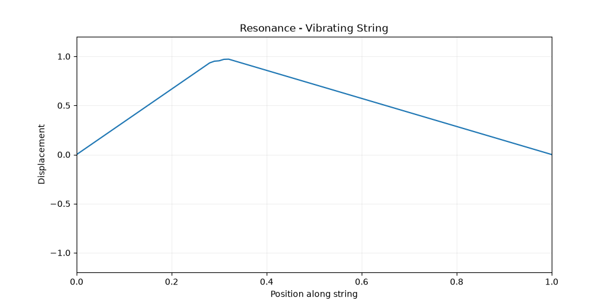
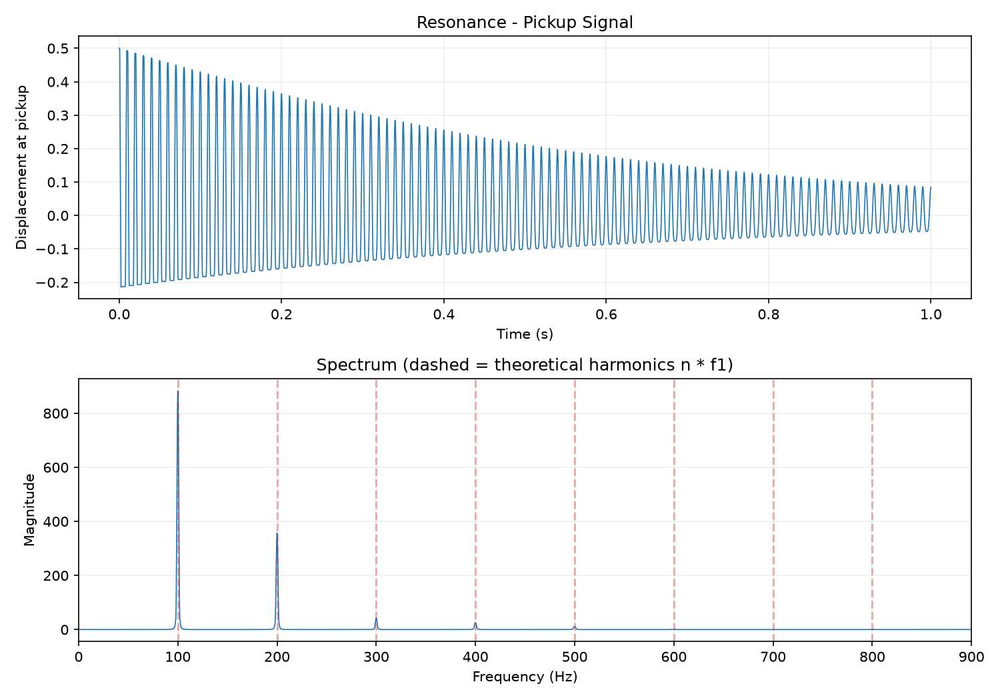

# Resonance

> A computational exploration of vibration, sound, and resonance.

Resonance models how a physical vibration becomes the sound we hear, starting with a single vibrating string.




## What it does

1. Simulates a plucked string by solving the 1D wave equation numerically
2. Records the string's motion at a "pickup" point
3. Uses Fourier analysis to measure each harmonic and compares it to theory
4. Turns the motion into a playable `.wav` file

## The physics

For an ideal string fixed at both ends, the frequency of the nth harmonic is

$$ f_n = \frac{n}{2L}\sqrt{\frac{T}{\mu}} $$

where `L` is string length, `T` is tension, `μ` is linear density, and `n` is the harmonic number.

The simulation solves the damped 1D wave equation with a finite-difference scheme:

$$ \frac{\partial^2 u}{\partial t^2} = c^2 \frac{\partial^2 u}{\partial x^2} - 2\gamma \frac{\partial u}{\partial t}, \qquad c = \sqrt{\frac{T}{\mu}} $$

The string is a set of discrete points evolved through time. Stability requires the Courant number `c·Δt/Δx ≤ 1`, and the code enforces this.

## Results

Default string: `c = 200 m/s`, `L = 1 m`, so the theoretical fundamental is 100 Hz.

<p align="center">  </p>

| Grid points | Courant number | Error at f₁ | Error at f₈ |
|---|---|---|---|
| 101 | 0.9 | −0.001 Hz | −0.40 Hz |
| 101 | 1.0 | 0.000 Hz | 0.000 Hz |
| 41 | 0.9 | −0.005 Hz | −2.58 Hz |
| 41 | 1.0 | 0.000 Hz | 0.000 Hz |

**Numerical dispersion:** on a coarse grid, short wavelengths travel slightly slower than the ideal wave equation predicts, so high harmonics come out flat. The error shrinks with more grid points, and at Courant = 1 the scheme is exact for the undamped 1D wave equation.

## Progress

- [x] Represent a string mathematically
- [x] Plucked-string model
- [x] Simulate and animate vibration
- [x] Measure oscillation frequency
- [x] Fourier analysis (windowed, zero-padded, interpolated peaks)
- [x] Analyze harmonics
- [x] Damping
- [x] Generate sound (WAV export)
- [ ] Frequency-dependent damping
- [ ] Interactive visualization (web)

## Run it

```bash
pip install -r requirements.txt
python resonance.py
```

This prints a table of theoretical vs. measured harmonics, writes `resonance.wav`, and opens the animation and spectrum plots.

## Built with

`Python` · `NumPy` · `SciPy` · `Matplotlib`

Planned: `TypeScript` · `React` · `Web Audio API`

## License

MIT
